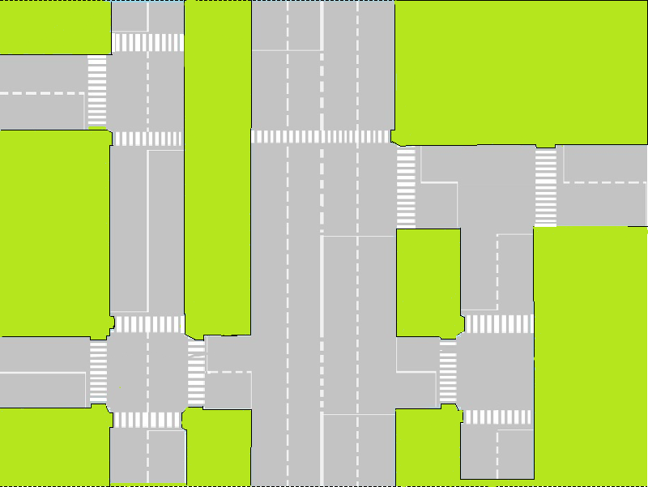

## Курсовой проект "Моделирование дорожного движения"
## Кафедра "Информационная безопаность", Москва 2020
#### Developed by Daniil Rybakov ICS8-33

### Содержание
 1. Моделирование на теории графов
 2. Использование 2D графики для построение модели
 3. Использовние языка C++ для реализации логики событий
 
###  Введение
В современной жизни, создавая проекты, которые будут опираться на повседневные задачи, всегда требуют математической подготовки, и как следствие хорошее понимание математических разделов и использование их в реализицаии задуманного. В моей теме курсовой работы "Моделирование дорожного движения" я буду использовать раздел Теории Графов для моделирование движения транспортных средств (автомобилей) на небольшом участке сети дорог (перёкрестки, двухполостные, однополостные дороги).

###  Теория 
###  Практика  

 
 последующие файлы будут добавлены позже..

###  Заключение
 ...
###  Опорный список литературы по теории графов
* [Математическое моделирование на графах](http://window.edu.ru/resource/223/75223/files/mmg.pdf)
* [Теория графов и сетей при моделировании процессов УВД](http://venec.ulstu.ru/lib/disk/2014/Karnauhov_3.pdf)
* [Оптимизация светофорного регулирования с помощью программы моделирования транспортных потоков](https://dspace.susu.ru/xmlui/bitstream/handle/0001.74/984/6.pdf?sequence=1&isAllowe)
